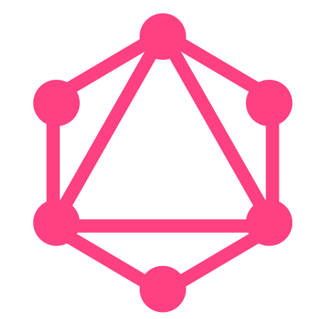

# :space_invader: Hello World :space_invader:

:blossom: My name is Angélica and I am a System Engineering student at the Universidad de Antioquia in Medellín, Colombia.
:hibiscus:
:sunflower: Series lover (I have an obsession).
:microphone:  I love singing.
:book: And sometimes i read hehehe.

## Tech Stack :cupid:

The tech stack that i use or  i have used is:

  
  
  
  

  
  
  
  
  
  
  
  

#

`I don't know what else to tell so, nice to meet you!`
